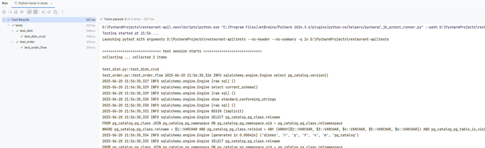

# Restaurant API – сервис для управления меню и заказами ресторана

## Запуск

```bash
git clone https://github.com/danil614/restaurant-api.git
cd restaurant_api
docker-compose up --build
```

Compose поднимет db (PostgreSQL 16) и api (Uvicorn :8000); при старте выполняются миграции.

## URL и доки

API: http://localhost:8000

Swagger: http://localhost:8000/docs

### Ключевые эндпоинты

```
GET  /dishes/             – список блюд
POST /dishes/             – создать блюдо
DELETE /dishes/{id}       – удалить

GET  /orders/             – список заказов
POST /orders/             – оформить заказ
DELETE /orders/{id}       – отменить (status = 'в обработке')
PATCH /orders/{id}/status – следующий этап статуса
```

## Тесты

```bash
pip install -r requirements.txt
pytest
```

